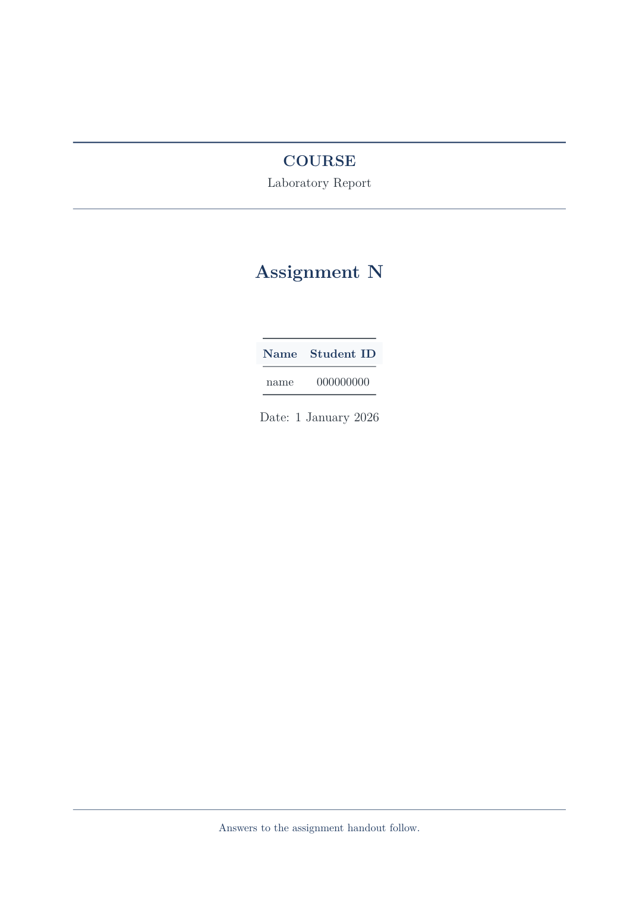
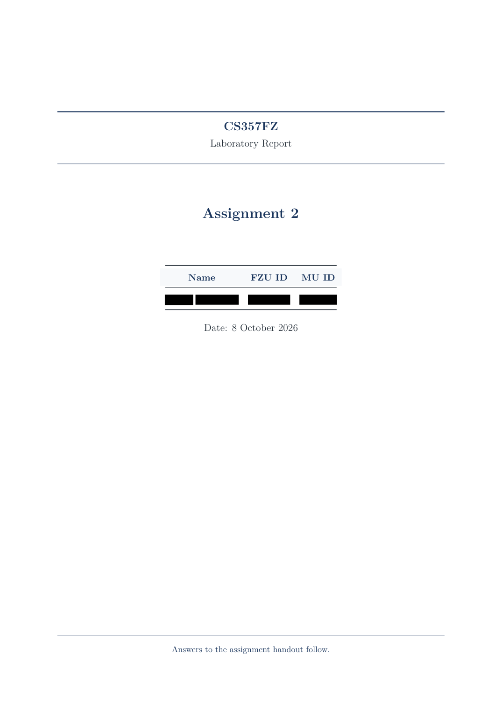
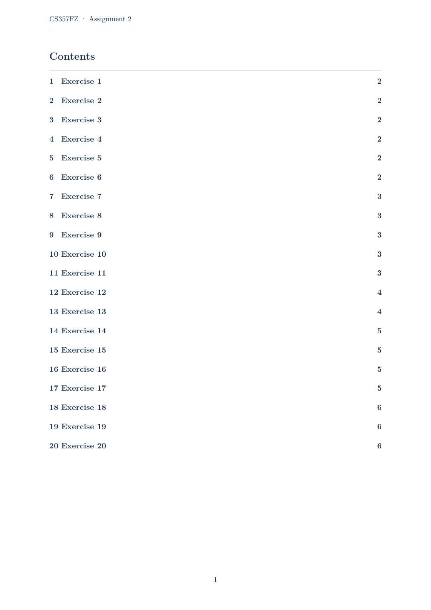
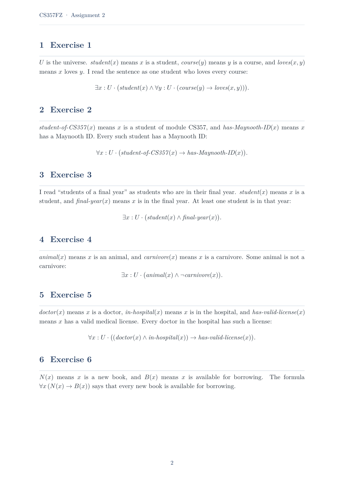
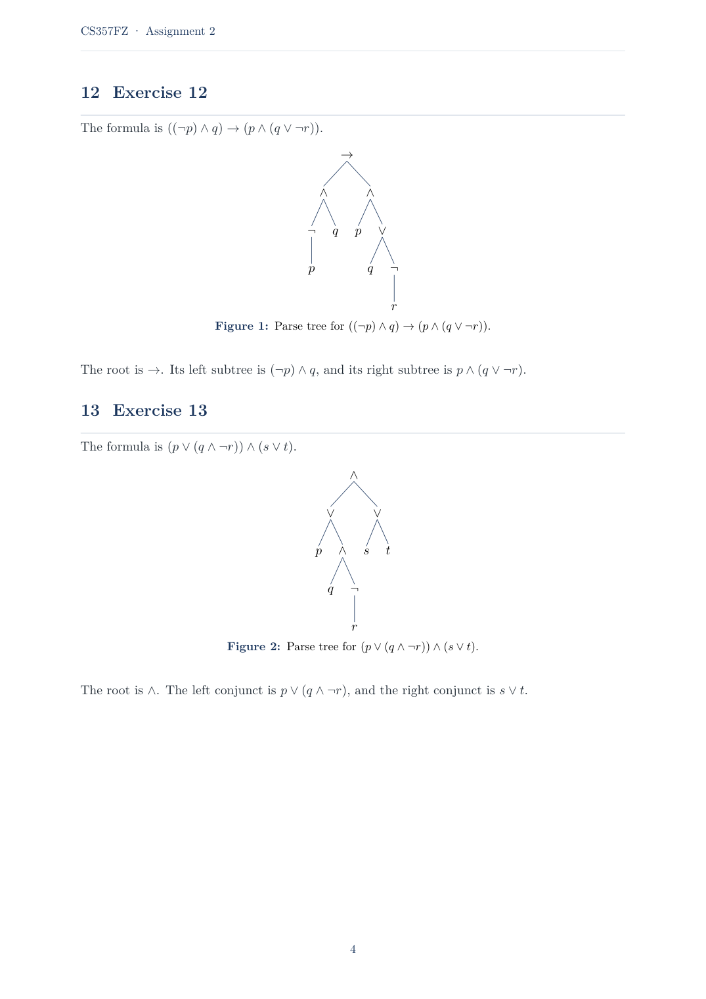

# Auto Course Lab Report

English | [中文](README.zh-CN.md)

A Cursor skill for one author's course laboratory report, set in XeLaTeX.

The report is built for three things.

- **No AI trace.** The voice is a student who did the sheet. The formula sits in the same sentence as the English. A truth table or a parse tree is followed by one sentence that reads it. There is no overview, no exercise the handout did not ask for, and no closing essay.
- **Concise.** Each exercise answers the question and then stops. A predicate is named in English once, then used as a symbol.
- **Complete.** Every exercise that asks for an answer gets its own section, in the handout's order. Letters, connectives, predicate names, and the row order of a truth table stay as the sheet printed them.

The report body is English. This page is the English copy of the documentation.

## Pages

`template.tex` is the shape every report starts from. The cover has the course code, the words Laboratory Report, the assignment number, one name, one student ID, and the date. The shipped placeholders are `COURSE`, `name`, `000000000`, and `1 January 2026`. A later section is one exercise from the handout: the sentence, the formula, and, when the sheet asks for it, a truth table or a tree.

The finished pages are from a completed assignment of twenty exercises. Only the author's name and the two ID numbers are covered. The course code in the header, the predicate names, the formulas, and the parse trees stay as written. Handwriting is used only when the handout asks for a photo.

| Empty template. The name is `name`, and the student ID is `000000000`. | Finished cover. The name and the two ID numbers are black. |
|---|---|
|  |  |

| Contents, one line for each required exercise. | Exercises 1 to 6. Each predicate is named once, then used in a formula. |
|---|---|
|  |  |

Exercises 12 and 13 draw the parse tree, then one sentence names the root and the two subtrees.

## Files

| File | Role |
|---|---|
| `SKILL.md` | Workflow and rules |
| `template.tex` | Cover, header, truth tables |
| `template.pdf` | The empty template, compiled |
| `student.md` | Name and student ID |
| `notation.md` | Connectives, quantifiers, table shape |
| `handwriting.md` | Photo step, only when a page must be handwritten |
| `docs/` | The figures on this page |

## Use

Place this folder where Cursor loads project skills. Give it the handout and ask for the report.

The cover name stays `name` until you replace it. The student ID is unset, and it is requested before the final PDF. It is not invented. From the `report/` directory, compile twice with XeLaTeX. The second pass fills the contents.
